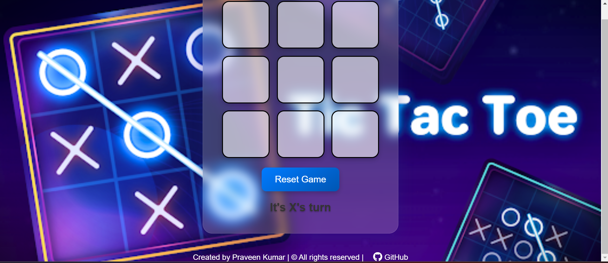

# Tic Tac Toe


---


This project is a simple implementation of the classic Tic Tac Toe game using HTML, CSS, and JavaScript. It allows two players to take turns marking spaces on a 3x3 grid, with the objective of getting three of their symbols in a row, column, or diagonal.



## DEMO:
https://prako227g.github.io/Tictactoe/

## Features

- Responsive design: The game adapts to different screen sizes using CSS Grid and media queries.
- Win detection: Automatically detects and declares a winner or a draw.
- Reset functionality: Allows players to restart the game at any time.
- Stylish user interface: Designed with modern CSS features for an enhanced user experience.

## Technologies Used

- **HTML**: Provides the structure of the webpage.
- **CSS**: Styles the elements and provides responsive design.
- **JavaScript**: Implements the game logic and handles user interactions.

## Setup Instructions

1. Clone the repository:

   ```bash
   git clone https://github.com/your-username/tic-tac-toe.git
   ```

2. Open the `index.html` file in your web browser.

## How to Play

- Player 1 starts the game with 'X'. Click on any cell in the grid to place 'X'.
- Player 2 follows with 'O'. Alternately click on empty cells to place 'O'.
- The game automatically detects and announces a winner if any player gets three symbols in a row, column, or diagonal.
- If all cells are filled without a winner, the game declares a draw.
- Click the "Reset Game" button to start a new game at any time.

## Acknowledgments

- Inspired by classic board games and online Tic Tac Toe implementations.

## Author

- [Praveen Kumar J](https://github.com/prako227g/)
- GitHub: [prako227g](https://github.com/prako227g/)

---
